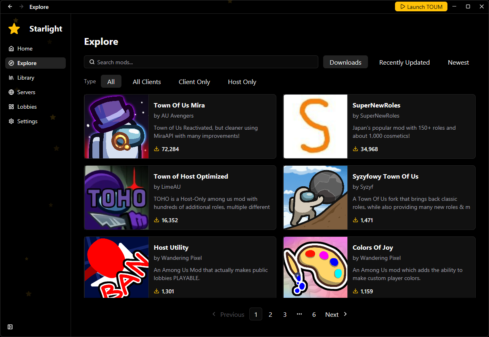
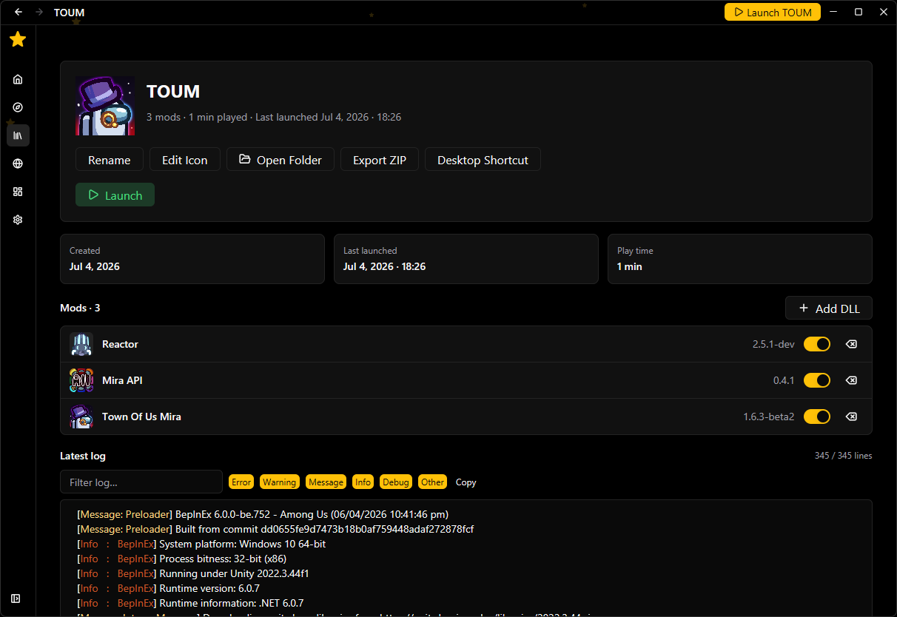

# Starlight PC


## Download

Get the latest release here:

https://github.com/All-Of-Us-Mods/Starlight-PC/releases/latest

## Screenshots

### Explore



### Profile



---

## Development Prerequisites

- Install VitePlus: https://viteplus.dev/guide/
- Install Rust: https://www.rust-lang.org/tools/install
- Install dev dependencies: `vp install`

## Development

```bash
vp install        # Install dependencies
vpr tauri dev      # Start in development mode
vpr tauri build    # Build for production
```

## Tech Stack

- **Framework**: [Tauri](https://tauri.app/) + [SvelteKit](https://kit.svelte.dev/)
- **Styling**: [Tailwind CSS](https://tailwindcss.com/) + [shadcn-svelte](https://www.shadcn-svelte.com/)
- **State**: [TanStack Query](https://tanstack.com/query)

## Disclaimer

This mod launcher is not affiliated with Among Us or Innersloth LLC, and the content contained therein is not endorsed or otherwise sponsored by Innersloth LLC. Portions of the materials contained herein are property of Innersloth LLC. © Innersloth LLC.

## License

Licensed under [GPLv3](LICENSE)
